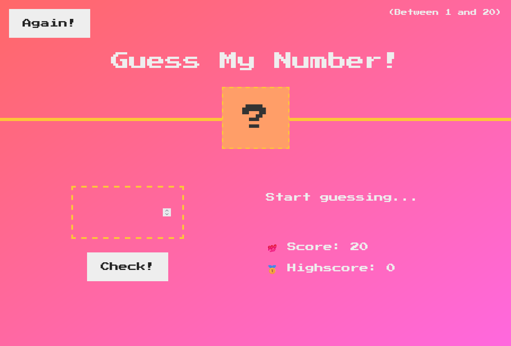

# Guess The Number

## Table of contents

- [Overview](#overview)
  - [The challenge](#the-challenge)
  - [Screenshot](#screenshot)
  - [Links](#links)
- [My process](#my-process)
  - [Built with](#built-with)
  - [What I learned](#what-i-learned)
- [Author](#author)

## Overview

### Screenshot

### Links

- Live Site URL: [Guess the number game!](https://irinakrdmva.github.io/Recipe-Page/)

## My process

### Built with

- Semantic HTML5 markup
- CSS custom properties
- Flexbox
- CSS Grid
- JavaScript

### What I learned

I have learned to better manipulate JS and I have deepened my understanding of how it functions. From here on it Will only get better!!!(Or harder😁)

## Author

- Website - [IrinaKrdmva](https://irinakrdmva.pt)
- Frontend Mentor - [@yourusername](https://www.frontendmentor.io/profile/IrinaKrdmva)
